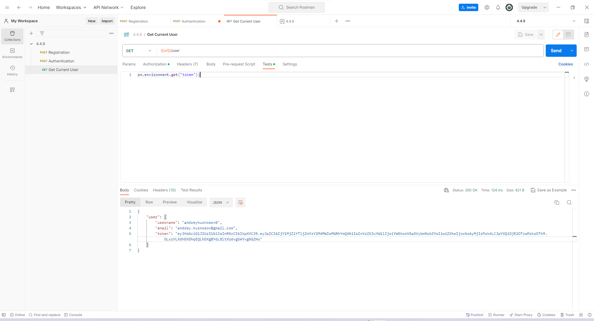

# 4.4.9

<figure>
  <figcaption>Регистрация</figcaption>
  
</figure>

<figure>
  <figcaption>Авторизация (Тело запроса)</figcaption>
  
</figure>

<figure>
  <figcaption>Авторизация. Добавление токена в локальную переменную </figcaption>
  
</figure>

<figure>
  <figcaption>Получение данных о пользователе. Добавление локальнную переменную в Headers</figcaption>
  
</figure>

<figure>
  <figcaption>Получение данных о пользователе. Получение локальнной переменной.</figcaption>
  
</figure>

