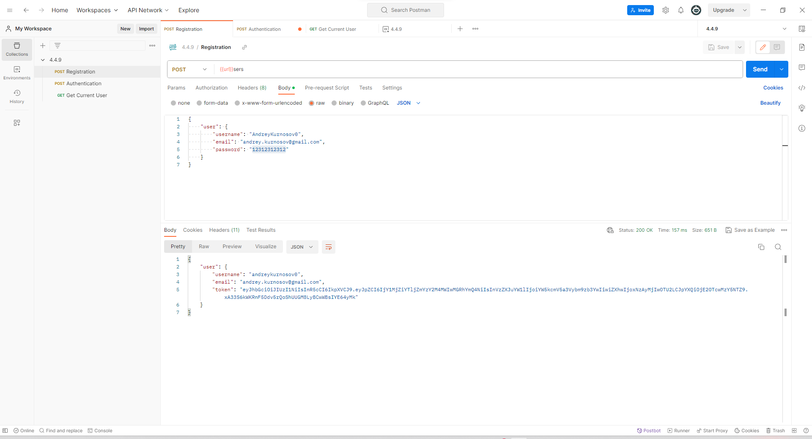
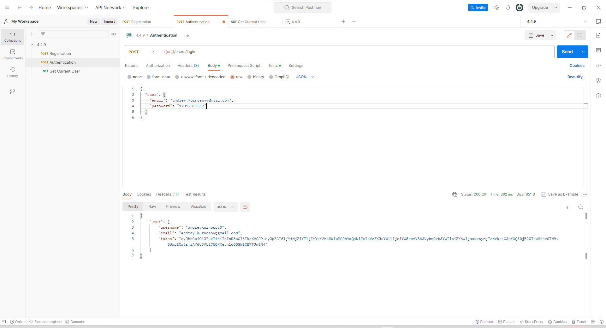
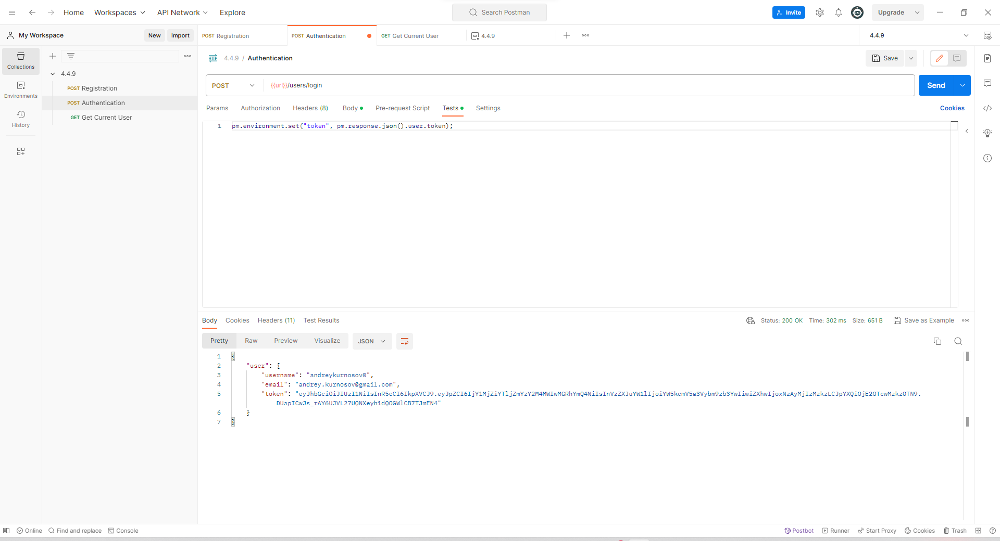
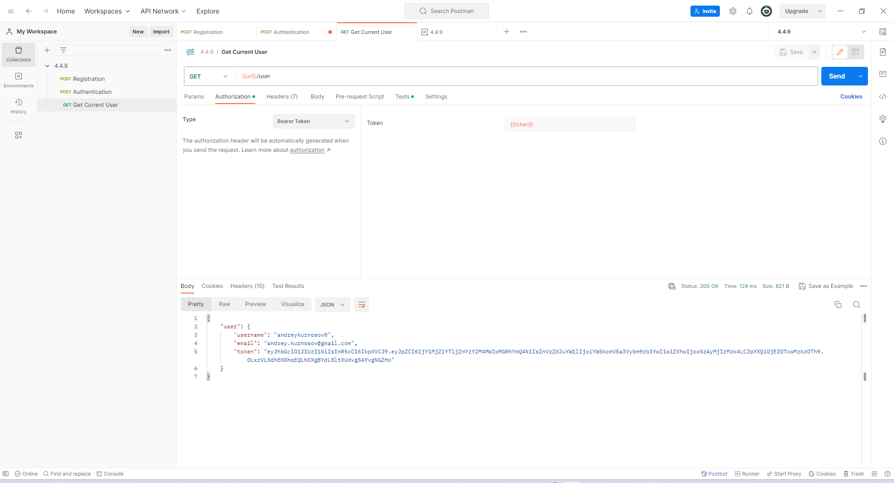

# 4.4.9

<figure>
  
  <figcaption>Регистрация</figcaption>
</figure>

<figure>
  
  <figcaption>Авторизация (Тело запроса)</figcaption>
</figure>

<figure>
  
  <figcaption>Авторизация. Добавление токена в локальную переменную </figcaption>
</figure>

<figure>
  
  <figcaption>Получение данных о пользователе. Добавление локальнную переменную в Headers</figcaption>
</figure>

<figure>
  
  <figcaption>Получение данных о пользователе. Получение локальнной переменной.</figcaption>
</figure>

